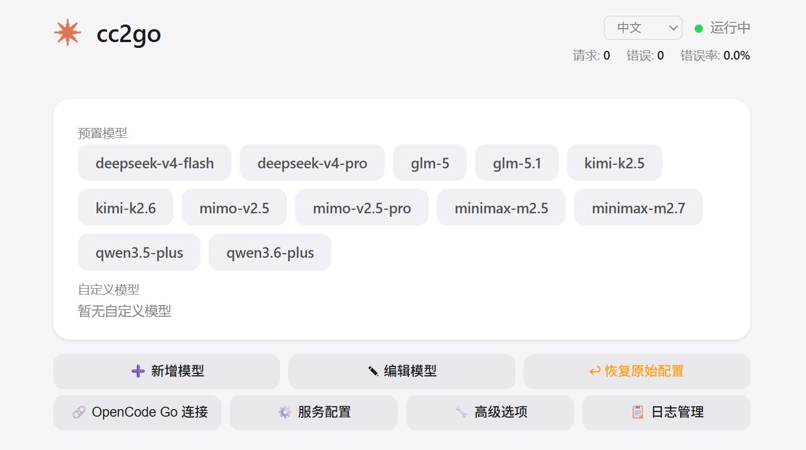

# cc2go <small>v0.7.7</small>

<p align="center">
  <b>Claude Code → OpenCode Go Adapter</b>
  <br>
  A lightweight proxy that lets Claude Code use any OpenAI-compatible model
</p>

<p align="center">
  
  
  
  
  
  
</p>

<p align="center">
  
  <br>
  <em>Web admin page — switch models, add endpoints, view logs</em>
</p>

## Features

- 🔄 **Protocol translation** — Converts Anthropic Messages API to OpenAI Chat Completions
- 🌐 **Web UI** — Built-in admin page at `http://localhost:4001`, click to switch models
- 🎯 **Model switching** — Click to switch models, auto-syncs to Claude Code settings
- ➕ **Custom models** — Add your own endpoints with independent API keys and URLs
- 🖼️ **Image support** — Converts Anthropic image blocks to OpenAI image_url format
- ⚡ **Streaming** — Real-time SSE streaming conversion (OpenAI → Anthropic format)
- 🔁 **Adaptive retry** — Error classification with exponential backoff, max 3 retries
- 📋 **Log management** — Built-in log viewer with rotation (5MB per file, 3 backups)
- 🖥️ **System tray** — Tray icon for opening admin page and quitting; auto-opens admin on start
- 💰 **Token saving** — Strips `<system-reminder>`, `[思考过程]` reasoning, and `thinking` blocks before forwarding upstream
- 💾 **Config backup** — Auto-backup original Claude Code config on first model switch; one-click restore from admin UI
- 🔑 **Security** — Defaults to 127.0.0.1 (local-only), Bearer Token authentication on proxy endpoints
- 🔧 **Tool name sanitization** — Replaces special characters in tool names to prevent 400 errors
- 🧹 **Schema cleaning** — Recursively removes incompatible JSON Schema fields for broader model compatibility

---

## Getting Started (For Non-Technical Users)

### Step 1: Download

Download the latest release from [GitHub Releases](https://github.com/lzg14/cc2go/releases).
Extract the ZIP file to any folder (not Program Files).

### Step 2: Configure API Key

1. Open the extracted folder
2. Copy `.env.example` to `.env` (or create a new file named `.env`)
3. Open `.env` with a text editor (like Notepad) and add your OpenCode Go API key:
   ```
   OPENCODE_API_KEY=your_api_key_here
   ```

### Step 3: Run

Double-click `start_bg.bat` in the folder.

A system tray icon will appear. The admin page will open automatically in your browser.

### Step 4: Open in Claude Code

In Claude Code's settings, configure:

| Setting | Value |
|---------|-------|
| Base URL | `http://localhost:4001` |
| API Key | `sk-cc2go-local` |

That's it! Use Claude Code as normal — select models from the web admin page at `http://localhost:4001`.

### How to Quit

Right-click the system tray icon → click "Exit".

---

## For Developers

```bash
pip install -r requirements.txt
cp .env.example .env   # Edit .env with your API key
python src/router.py
```

### Scripts (Windows)

```
scripts\start_bg.bat    # Background mode (system tray, no terminal)
scripts\stop.bat        # Stop background process
```

---

## Docker

```bash
docker build -t cc2go .
docker run -d -p 4001:4001 --env-file .env cc2go
```

Access at `http://localhost:4001`.

## Linux Service (systemd)

For permanent deployment on Linux:

```bash
# Copy service file
sudo cp cc2go.service /etc/systemd/system/
sudo systemctl daemon-reload
sudo systemctl enable cc2go
sudo systemctl start cc2go
```

Requires a `cc2go` user and `/opt/cc2go` installation directory.

---

## API Endpoints

| Endpoint | Method | Description |
|----------|--------|-------------|
| `/` | GET | Web admin UI |
| `/v1/messages` | POST | Claude format entry (Anthropic → OpenAI) |
| `/v1/chat/completions` | POST | OpenAI format passthrough |
| `/v1/models` | GET | List available models |
| `/health` | GET | Health check |
| `/api/config` | GET/PUT | Configuration management |
| `/api/custom-models` | GET/PUT | Custom model management |
| `/api/logs` | GET | Recent log entries |

---

## Custom Model Routing

| Endpoint | Behavior |
|----------|----------|
| `/v1/messages` | Anthropic format passthrough (no conversion, thinking blocks preserved) |
| `/v1/chat/completions` | OpenAI format conversion (tool_calls gets reasoning_content="" if missing) |

---

## Configuration

All configuration via Web UI (`http://localhost:4001`):
- **Connection** — OpenCode Go base URL and API key
- **Service** — Host, port, master key (auto-syncs to Claude Code)
- **Custom Models** — Add/edit/remove custom model endpoints
- **Logs** — View logs, set log level, toggle detailed logging

---

## License

MIT

> Technical details in [ARCHITECTURE.md](ARCHITECTURE.md)